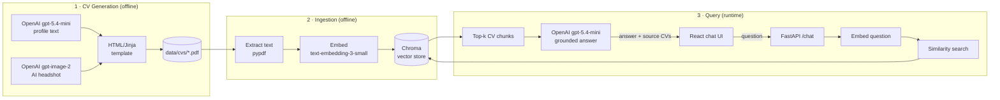
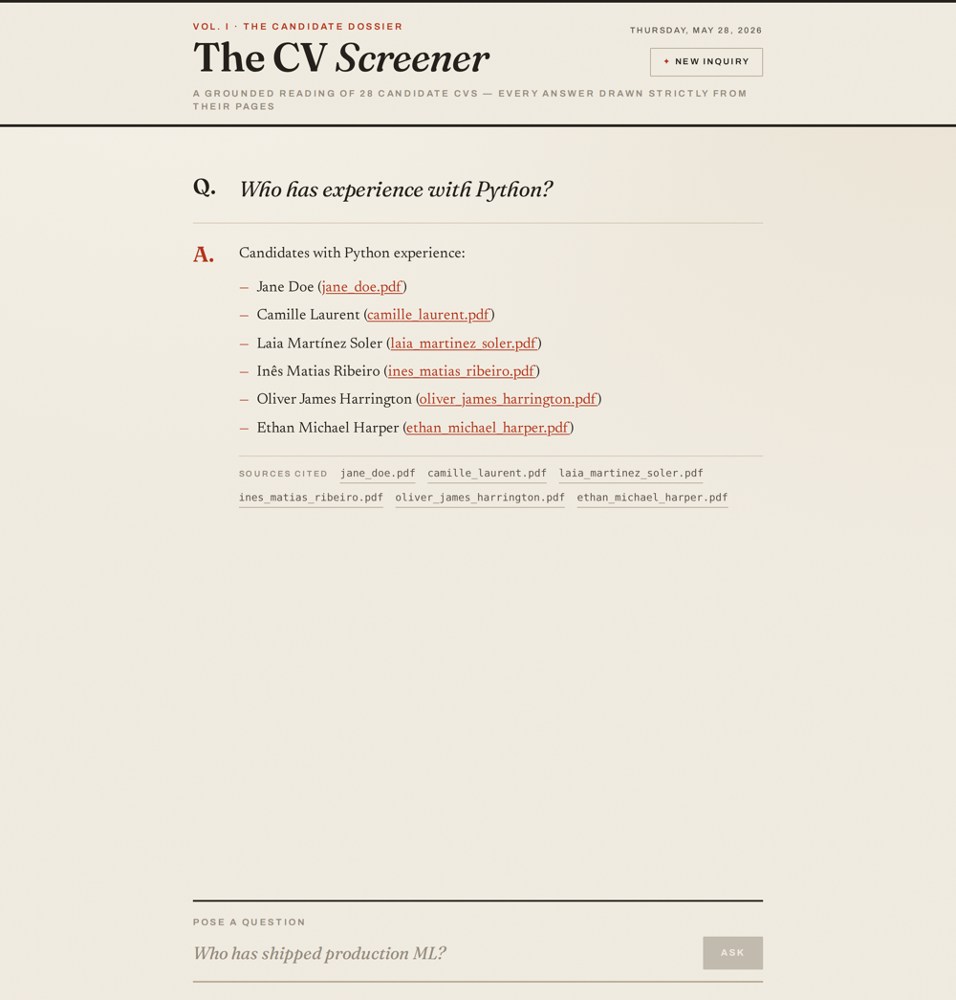
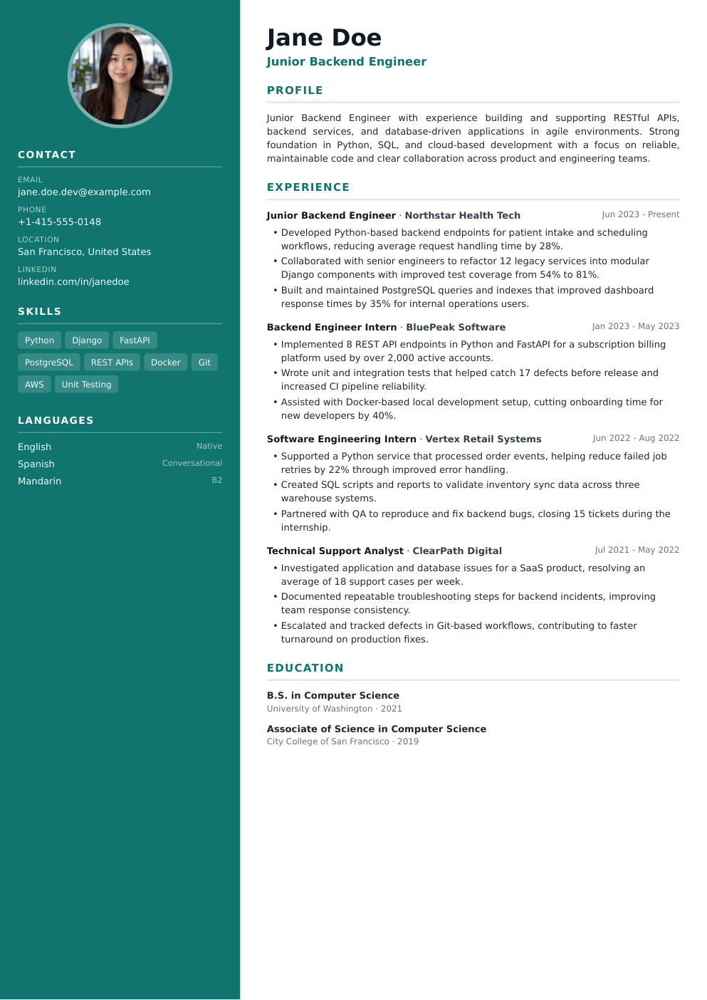

# AI-Powered CV Screener

A chat application for screening résumés. Ask natural-language questions about a
collection of CVs and get answers grounded in their content, with the source CVs cited.

Built as a Retrieval-Augmented Generation (RAG) pipeline:

1. **CV Generation** — 25–30 realistic fake CVs (PDF, with AI-generated photos).
2. **RAG Workflow** — extract → chunk → embed → store → retrieve, grounded on the CVs only.
3. **Chat Interface** — a clean web UI to ask questions and see the answer + source CVs.

---

## Architecture



## Tech stack

| Layer        | Choice                                  | Why |
|--------------|-----------------------------------------|-----|
| LLM + embeddings | OpenAI — `gpt-5.4-mini` + `text-embedding-3-small` | Latest cost-effective chat + embeddings; streams token-by-token |
| Vector store | Chroma (local, embedded)                | Zero external accounts, runs fully locally |
| Backend      | Python + FastAPI                        | Clean RAG service, easy to read |
| Frontend     | React + Vite + TypeScript + Tailwind    | Simple, fast chat UI |
| CV photos    | OpenAI `gpt-image-2` (fallback: initials avatar) | Unique AI headshot per candidate, inferred from name/role/location |
| CV profile text | OpenAI — `gpt-5.4-mini` (structured JSON) | Generates the fictional résumé content |

**Production swaps** (not built here to keep the prototype focused): the vector
store can be swapped for **Pinecone/Weaviate**, the query path wrapped in a
**LangGraph** agent, and traced with **Langfuse**.

---

## Screenshots

| Chat interface | A generated CV |
|---|---|
|  |  |

Answers are grounded in the CVs and cite the source files actually used — each `.pdf`
mention and source chip links to the candidate's PDF.

**AI-generated headshots** — a unique `gpt-image-2` portrait per candidate, inferred
from their name, role, and location:


---

## Quick start

> Requires Python 3.12+, Node 20+, and an [OpenAI API key](https://platform.openai.com/api-keys).

```bash
cp .env.example .env        # add your OPENAI_API_KEY
```

**1. Generate CVs**

```bash
cd backend && python -m venv .venv && source .venv/bin/activate
pip install -r requirements.txt
python ../scripts/generate_cvs.py     # writes data/cvs/*.pdf
```

**2. Ingest into the vector store**

```bash
python ingest.py                      # builds backend/chroma_db/
```

**3. Run the backend**

```bash
uvicorn app:app --reload --port 8000
```

**4. Run the frontend**

```bash
cd ../frontend && npm install && npm run dev   # http://localhost:5173
```

## Sample questions

- "Who has experience with Python?"
- "Which candidate graduated from UPC?"
- "Summarize the profile of Jane Doe."

---

## Project layout

```
scripts/generate_cvs.py       # CV generation (text + AI photo + PDF)
scripts/regenerate_photos.py  # re-shoot photos for existing profiles (no text re-gen)
backend/
  app.py                  # FastAPI /chat endpoint
  ingest.py               # PDF -> chunks -> embeddings -> Chroma
  rag.py                  # retrieval + grounded generation
  requirements.txt
frontend/                 # React + Vite chat UI
data/cvs/                 # generated PDFs (committed so reviewers see output)
data/photos/              # AI headshots · data/profiles/ # source JSON
docs/                     # diagram source / notes
```
